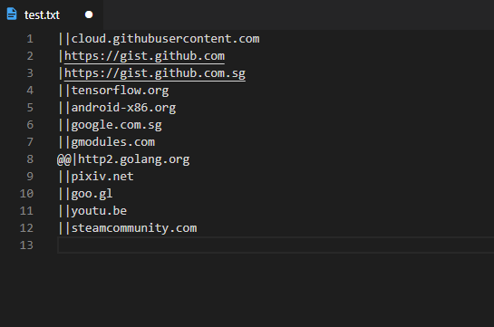
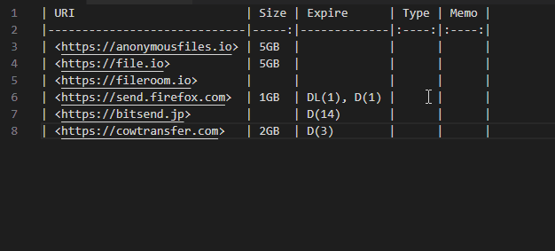
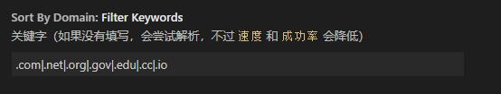

# vscode-sort-by-domain

## Features

This extension contributes the following functionalities:

* `vscode-sort-by-domain.sort`: Sort current selection lines by domain.

## Configuration

* `Move failed parsing rows to`: Bottom/Top

	> If you choose the "Bottom", the line 1-2 will move to line 7-8

	

* `Keywords`: If it is not filled in, it will try to parse it
